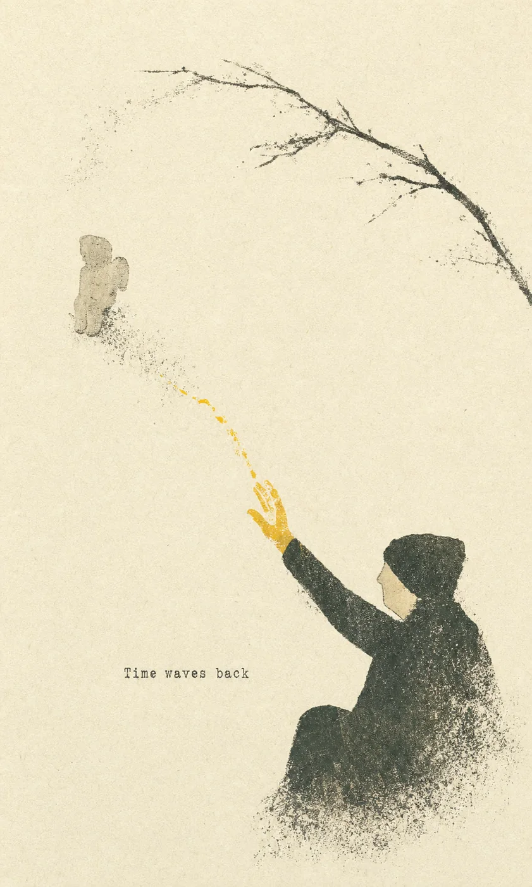

# Momentmade Skills

**You don’t have to be a designer to create something beautiful from your own photos and ideas.**

**你不需要会设计。只要你知道自己喜欢什么，就可以把照片、记忆和想法变成属于自己的艺术。**

 

An open, community-curated catalog of art-direction Skills for AI image creation. 
一个开放、由社区共同整理的 AI 图像艺术 Skill 目录。

[Explore the catalog](catalog/) · [How to contribute](CONTRIBUTING.md) · [中文说明](#about-this-catalog--关于这个目录)

---

## Featured collection · 本期收录

### [Gathered Scenes Zine · 拾景纸刊](https://github.com/Zeejay0/gathered-scenes-zine-skill)

By [Zeejay0](https://github.com/Zeejay0) · 2 Skills · photo-to-paper art direction

Turn an everyday photograph into a page worth keeping. One Skill preserves the real scene inside a tactile collage; the other distills the photograph into an entirely new illustration.

把日常照片变成值得留下的一页：一种保留真实影像，用撕纸、插画与留白重新组织画面；另一种只提取照片里的情绪和关系，重新创作成独立插画。

<table>
  <tr>
    <td width="50%" valign="top">
      
      <h3>实景拼贴 · Gathered Scenes</h3>
      
<strong>Keep the photograph. Recompose the memory.</strong> 保留照片里的真实场景，再用纸张、色彩、插画和留白重新编排记忆。

      
<a href="https://github.com/Zeejay0/gathered-scenes-zine-skill/tree/main/skills/scenes-gathered-zine-v1-3"><strong>View the original Skill →</strong></a>

    </td>
    <td width="50%" valign="top">
      
      <h3>影像蒸馏 · Scene Distillation</h3>
      
<strong>Keep the feeling. Reimagine the image.</strong> 不保留原照片本身，只留下主体、动作和情绪，再创作成一张全新的纸上作品。

      
<a href="https://github.com/Zeejay0/gathered-scenes-zine-skill/tree/main/skills/scene-distillation-zine-v1-3"><strong>View the original Skill →</strong></a>

    </td>
  </tr>
</table>

> **License note / 许可证说明** 
> These two Skills and the preview artworks remain under Zeejay0’s [Personal Non-Commercial License](licenses/gathered-scenes-zine-personal-non-commercial-v1.0.txt). They are for personal, non-commercial use; commercial or paid use requires the author’s prior written permission. The Skill files are not mirrored here—follow the links above to use the originals. 
> 这两个 Skill 与展示作品仍遵循 Zeejay0 的[个人非商业许可证](licenses/gathered-scenes-zine-personal-non-commercial-v1.0.txt)。仅限个人、非商业使用；商业或付费使用需要事先获得作者书面许可。本目录没有镜像 Skill 文件，请通过上方链接前往原仓库使用。

## How this catalog works

Momentmade Skills collects distinct, reusable visual systems—not a pile of generic prompts. Every entry records its original author, canonical source, license, and representative outputs.

- **Hosted Skills** are included in full only when a permissive license or explicit permission allows redistribution.
- **External Skills** stay in the author’s repository when their license is restrictive or unclear. This catalog stores factual metadata, canonical links, and only those preview images that may be shared here.
- **For agents:** read the structured entries in [`catalog/`](catalog/) to find the canonical Skill URL, usage terms, media provenance, and local preview paths.

Image generation happens in your own compatible AI environment. This repository is only a public catalog: it does not run a generation service, sell model access, or belong to another product or project.

## About this catalog · 关于这个目录

Momentmade Skills 把审美整理成清晰、可复用的创作方向：怎样理解一张照片或一个想法，怎样处理构图、色彩、材质与文字，以及怎样避开让结果变得普通的细节。

- **完整托管 Skill**：只有在宽松许可证或明确授权允许再分发时，才会完整收录在本仓库。
- **外部 Skill**：当许可证有限制或权利不明确时，Skill 留在原作者仓库；这里记录作者、正式来源、使用条款，以及明确允许展示的预览作品。
- **给 Agent**：读取 [`catalog/`](catalog/) 中的结构化条目，即可找到原始 Skill 地址、许可证、媒体来源与本地预览路径。

生图发生在你自己的兼容 AI 环境中。这个仓库只是一个独立的公开目录，不提供生图服务、不出售模型访问，也不属于任何其他产品或项目。

## Contribute · 一起共创

Original Skills, carefully sourced external entries, representative outputs, and metadata corrections are welcome. Before copying third-party material, read [CONTRIBUTING.md](CONTRIBUTING.md) and verify the rights for the Skill text and every image separately.

欢迎提交原创 Skill、来源清楚的外部条目、代表性输出，以及作者、来源和许可证信息的修正。在复制第三方内容前，请先阅读 [CONTRIBUTING.md](CONTRIBUTING.md)，并分别确认 Skill 文本和每张图片的权利。

## License · 许可证

Repository code and original documentation are available under the [MIT License](LICENSE) unless stated otherwise. Third-party Skills and media keep their own licenses; the root MIT license does not replace or expand those terms.

除非另有声明，仓库代码和原创文档使用 [MIT License](LICENSE)。第三方 Skill 与媒体继续遵循各自的许可证；根目录的 MIT 许可证不会替代或扩大这些条款。
