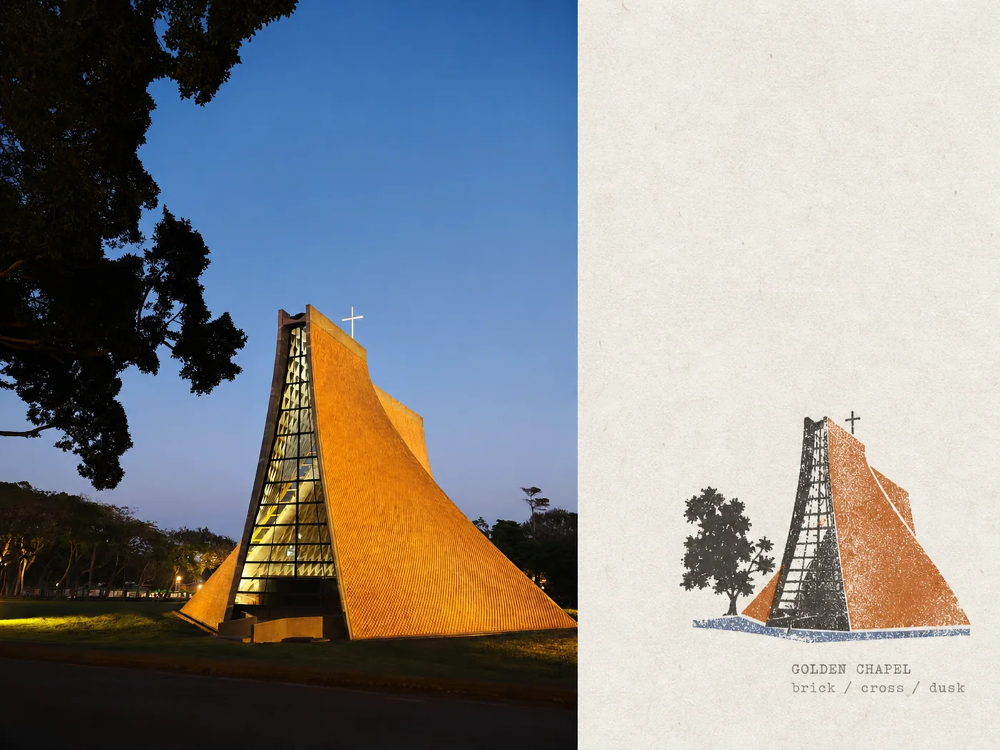
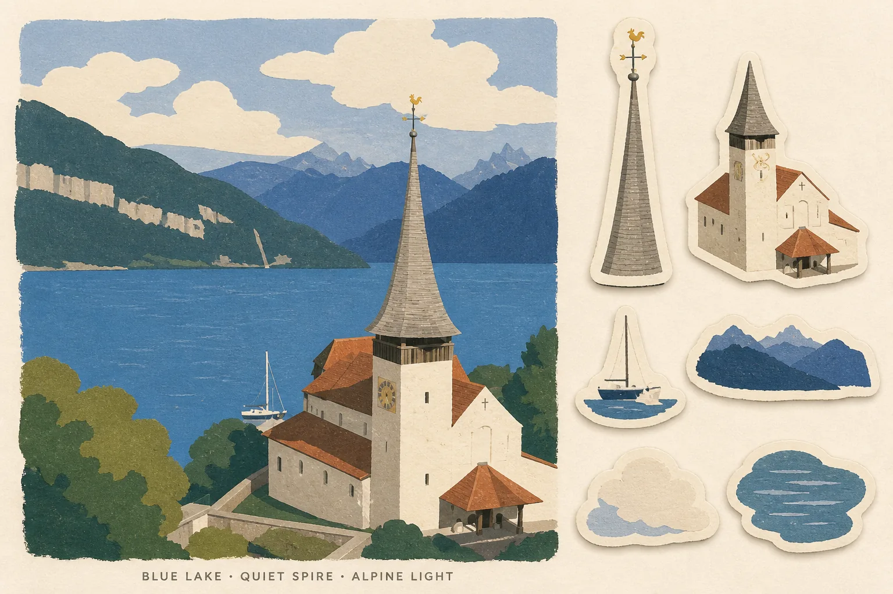
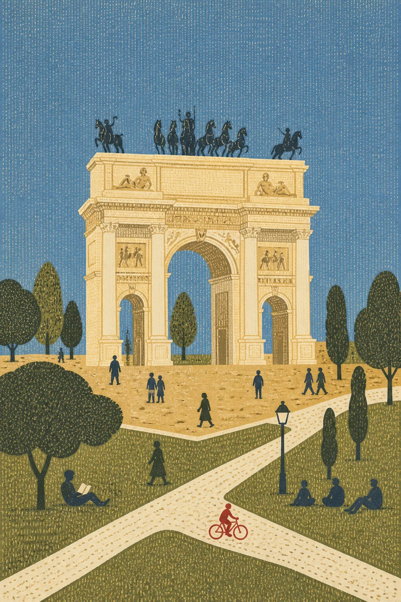
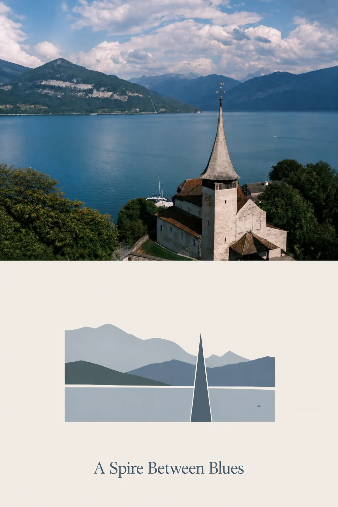

# Momentmade Skills

**You don’t have to be a designer to create something beautiful from your own photos and ideas.**

**你不需要会设计。只要你知道自己喜欢什么，就可以把照片、记忆和想法变成属于自己的艺术。**

 

An open, community-curated catalog of art-direction Skills for AI image creation. 
一个开放、由社区共同整理的 AI 图像艺术 Skill 目录。

[Explore the catalog](catalog/) · [How to contribute](CONTRIBUTING.md) · [中文说明](#about-this-catalog--关于这个目录)

---

## Gallery · 画廊

<table>
  <tr>
    <td width="50%" valign="top">
      
      <h3>实景拼贴 · Gathered Scenes</h3>
      
<strong>Keep the photograph. Recompose the memory.</strong> 保留照片里的真实场景，再用纸张、色彩、插画和留白重新编排记忆。

      
<a href="https://github.com/Zeejay0/gathered-scenes-zine-skill/tree/main/skills/scenes-gathered-zine-v1-3"><strong>View the original Skill →</strong></a> <a href="licenses/gathered-scenes-zine-personal-non-commercial-v1.0.txt">Personal, non-commercial license</a> · © Zeejay0

    </td>
    <td width="50%" valign="top">
      
      <h3>影像蒸馏 · Scene Distillation</h3>
      
<strong>Keep the feeling. Reimagine the image.</strong> 不保留原照片本身，只留下主体、动作和情绪，再创作成一张全新的纸上作品。

      
<a href="https://github.com/Zeejay0/gathered-scenes-zine-skill/tree/main/skills/scene-distillation-zine-v1-3"><strong>View the original Skill →</strong></a> <a href="licenses/gathered-scenes-zine-personal-non-commercial-v1.0.txt">Personal, non-commercial license</a> · © Zeejay0

    </td>
  </tr>
  <tr>
    <td width="50%" valign="top">
      
      <h3>照片图章档案 · Photo Stamp Archive</h3>
      
<strong>Keep the photograph. Distill its mark.</strong> 保留照片本身，再把主体浓缩成一枚带有磨损油墨质感的专属图章。

      
<a href="https://github.com/Dlcccc71913/skill-make-photo-stamp-archive"><strong>View the original Skill →</strong></a> <a href="licenses/make-photo-stamp-archive-mit.txt">MIT License</a> · © Dlcccc71913

    </td>
    <td width="50%" valign="top">
      
      <h3>旅行记忆贴纸卡 · Travel Memory Sticker Card</h3>
      
<strong>Keep the landmark. Collect its fragments.</strong> 把旅途照片重绘成安静的纸上风景，再从其中拾取六枚值得收藏的记忆贴纸。

      
<a href="https://github.com/carolinaaafy/travel-memory-sticker-card"><strong>View the original Skill →</strong></a> <a href="https://github.com/carolinaaafy/travel-memory-sticker-card/blob/main/LICENSE">Personal-use Skill license</a> · © carolinaaafy

    </td>
  </tr>
  <tr>
    <td width="50%" valign="top">
      
      <h3>局外艺术 · Outsider Art</h3>
      
<strong>Flatten the place. Let repetition make it quiet.</strong> 把建筑、路径与日常人物平铺成地图般的色块，再用密纹和唯一一枚亮色重组场所记忆。

      
<a href="https://github.com/fihaaade/skills/tree/main/outsider-art"><strong>View the original Skill →</strong></a> Preview: <a href="LICENSE">MIT License</a> · Skill license not published · © fihade

    </td>
    <td width="50%" valign="top">
      
      <h3>摄影抽象编辑 · Photo Abstract Editorial</h3>
      
<strong>Keep the photograph. Distill its relationships.</strong> 忠实保留原照片，再把其中的空间、色彩与节奏提炼成克制的象牙色抽象记忆面板。

      
<a href="https://github.com/ZzzLc0405/photo-abstract-editorial"><strong>View the original Skill →</strong></a> Preview: <a href="LICENSE">MIT License</a> · <a href="https://github.com/ZzzLc0405/photo-abstract-editorial/blob/main/LICENSE.md">Skill: personal/non-commercial terms</a> · © ZzzLc0405

    </td>
  </tr>
</table>

## How this catalog works

Momentmade Skills collects distinct, reusable visual systems—not a pile of generic prompts. Every entry records its original author, canonical source, license, and representative outputs.

- **Hosted Skills** are limited to original submissions or permissively reusable material found outside GitHub without a durable source repository.
- **External Skills** include every Skill that already has a GitHub repository, regardless of license, plus material whose rights are restrictive or unclear. This catalog stores factual metadata, canonical links, and only those preview images that may be shared here.
- **For agents:** read the structured entries in [`catalog/`](catalog/) to find the canonical Skill URL, usage terms, media provenance, and local preview paths.

Image generation happens in your own compatible AI environment. This repository is only a public catalog: it does not run a generation service, sell model access, or belong to another product or project.

## About this catalog · 关于这个目录

Momentmade Skills 把审美整理成清晰、可复用的创作方向：怎样理解一张照片或一个想法，怎样处理构图、色彩、材质与文字，以及怎样避开让结果变得普通的细节。

- **完整托管 Skill**：仅用于首次发布在这里的原创投稿，或来自 GitHub 之外、没有稳定源码仓库且明确允许再分发的内容。
- **外部 Skill**：只要已经有 GitHub 仓库，无论许可证多宽松，都只链接原仓库；许可证有限制或权利不明确的内容也采用外部条目。这里记录作者、正式来源、使用条款，以及明确允许展示的预览作品。
- **给 Agent**：读取 [`catalog/`](catalog/) 中的结构化条目，即可找到原始 Skill 地址、许可证、媒体来源与本地预览路径。

生图发生在你自己的兼容 AI 环境中。这个仓库只是一个独立的公开目录，不提供生图服务、不出售模型访问，也不属于任何其他产品或项目。

## Contribute · 一起共创

Original Skills, carefully sourced external entries, representative outputs, and metadata corrections are welcome. Before copying third-party material, read [CONTRIBUTING.md](CONTRIBUTING.md) and verify the rights for the Skill text and every image separately.

欢迎提交原创 Skill、来源清楚的外部条目、代表性输出，以及作者、来源和许可证信息的修正。在复制第三方内容前，请先阅读 [CONTRIBUTING.md](CONTRIBUTING.md)，并分别确认 Skill 文本和每张图片的权利。

## License · 许可证

Repository code and original documentation are available under the [MIT License](LICENSE) unless stated otherwise. Third-party Skills and media keep their own licenses; the root MIT license does not replace or expand those terms.

除非另有声明，仓库代码和原创文档使用 [MIT License](LICENSE)。第三方 Skill 与媒体继续遵循各自的许可证；根目录的 MIT 许可证不会替代或扩大这些条款。
